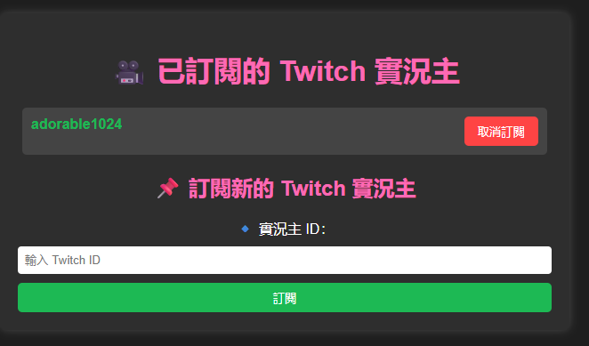

# Twitch Line Bot

## 📝 Overview
Twitch Line Bot is an automated notification system that alerts a LINE group when a specific Twitch streamer goes live. It integrates **Twitch's EventSub Webhook API** with **LINE Messaging API** to provide real-time updates.

## 📂 Project Structure
```
TWITCH_LINE_BOT/
├── app/
│   ├── templates/
│   │   ├── subscriptions.html  ✅ Web interface for managing subscriptions
│   ├── config.py  ✅ Configuration handler
│   ├── line.py  ✅ LINE Messaging API integration
│   ├── main.py  ✅ Flask server handling Twitch Webhooks
│   ├── twitch.py  ✅ Twitch API subscription management
├── .env  ✅ Environment variables
├── .gitignore
├── Dockerfile  ✅ Docker setup for easy deployment
├── example.env  ✅ Template for environment variables
├── LICENSE  ✅ Open-source license
├── README.md  ✅ Documentation
├── requirements.txt  ✅ Dependencies
├── start.sh  ✅ Script to start Flask + Ngrok
```
## Features
- 🟣 **Live Stream Detection**: Monitors Twitch `stream.online` events.
- 💬 **LINE Notifications**: Sends messages to a designated LINE group.
- ⚙️ **Easy Deployment**: Packaged with Docker for quick setup.
- 🔧 **Customizable Alerts**: Supports message formatting and multi-streamer tracking.

## ⚙️ Installation & Setup

### **1. Clone the Repository**
```bash
git clone https://github.com/your-username/twitch-line-bot.git
cd twitch-line-bot
```
### **2. Install Dependencies**
```bash
pip install -r requirements.txt
```
### **3. Set Up Environment Variables**
Create an .env file using example.env as a reference:

```bash
cp example.env .env
```
Then, edit .env to include your API keys:


🎮 Twitch API 設定
```
TWITCH_CLIENT_ID=your_twitch_client_id
```
🔹 取得方式：前往 [Twitch Developer Console](https://dev.twitch.tv/console) 建立應用程式，會獲得 `Client ID`
```
TWITCH_CLIENT_SECRET=your_twitch_client_secret
```
🔹 取得方式：在 Twitch Developer Console 內 **管理應用程式**，可生成 `Client Secret`
⚠️ 請 **妥善保管**，避免洩露！
```
TWITCH_ACCESS_TOKEN=your_twitch_access_token
```
🔹 取得方式：使用 Twitch OAuth API 進行身份驗證，獲取 `Access Token` 要記得用戶端類型用機密不然不會有用戶端密碼
📌 可以透過 `curl` 或 `requests` 請求 Twitch OAuth 來生成：
```
curl -X POST "https://id.twitch.tv/oauth2/token" -d "client_id=<你的 TWITCH_CLIENT_ID>&client_secret=<你的 TWITCH_CLIENT_SECRET>&grant_type=client_credentials"
```
🌍 Webhook CALLBACK URL
```
CALLBACK_URL=https://your-callback-url/webhook
```
🔹 取得方式：啟動你的網域 例如：Ngrok (`ngrok http 8080`)，然後執行 `curl http://localhost:4040/api/tunnels` 來獲取 `public_url`

💬 LINE API 設定
```
LINE_ACCESS_TOKEN=your_line_channel_token
```
🔹 取得方式：前往 [LINE Developers](https://developers.line.biz/) 建立 Messaging API 並獲取 `Channel Access Token`
```
GROUP_ID=your_line_group_id
```
🔹 取得方式：使用 LINE Bot 向群組發送訊息，然後在 Webhook 內解析 `groupId`

📌 你也可以透過 LINE API 取得 `groupId`


### **4. Run Webhook Server**
```bash
python app/main.py
```
### **5. Subscribe to Twitch EventSub**
```bash
python app/twitch.py
```
### **6. Docker Deployment**
```bash
docker build -t twitch-line-bot .
docker run -d -p 8080:8080 --env-file .env twitch-line-bot
```
## 🖥️ Web Interface
Once deployed, you can manage subscriptions via the web interface at:
http://127.0.0.1:8080/


## Usage
Once deployed, the bot will automatically send LINE notifications when a Twitch streamer goes live.
Future Enhancements
- ✅ Support multiple streamers
- ✅ Add rich media notifications (stream thumbnail, title, etc.)
- ✅ Implement a web dashboard for managing subscriptions
## 📜 License
MIT License
